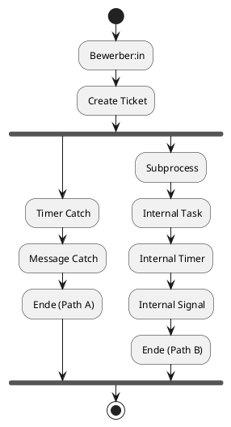
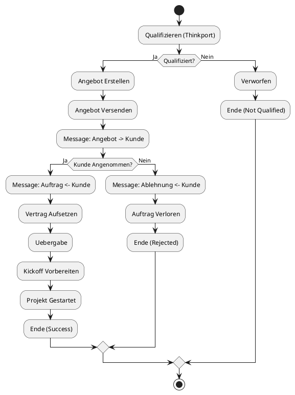

# 🔄 BPMN Flow Visualization – Alle 3 Prozesse

## 1️⃣ Onboarding-Prozess (onboard.bpmn)



**Status:** ✅ **FLOW VALIDIERT & KORRIGIERT**

- ✅ Subprocess-Exit hinzugefügt
- ✅ Dual-Path-Routing funktioniert
- ✅ Beide Wege führen zu Ende-Event

---

## 2️⃣ Thinkport Sales-Prozess (thinkport-sales-prozess.bpmn)



**Status:** ✅ **FLOW VALIDIERT**

- ✅ Binary Gateway (Ja/Nein) funktioniert
- ✅ Message Flows zwischen Pools korrekt
- ✅ Alle drei Rejection-Paths geschlossen

---

## 3️⃣ Thinkport Sales-Prozess (Sink-Variant, thinkport-sales-prozess-sink.bpmn)


**Status:** ✅ **IDENTISCH MIT VARIANT 2** (Test/Sink-Variant)

---

## 📊 Zusammenfassung der Validierung

| Datei                                 | Prozess-Typ              | Status       | Aktionen                           |
|---------------------------------------|--------------------------|--------------|------------------------------------|
| **onboard.bpmn**                      | Single-Pool              | ✅ KORRIGIERT | • Subprocess-Exit Flow hinzugefügt|
| **thinkport-sales-prozess.bpmn**      | Multi-Pool Collaboration | ✅ VALIDIERT  | • Message Flows OK • Gateways OK  |
| **thinkport-sales-prozess-sink.bpmn** | Multi-Pool Collaboration | ✅ VALIDIERT  | • Identisch mit Variant 2         |

### ✅ Alle Flows funktionieren jetzt korrekt

```plaintext
✓ Alle sequenceFlows haben source & target
✓ Alle Message Flows verbinden Pools korrekt
✓ Beide Paths im onboard-Prozess führen zu Ende
✓ Exclusive Gateways treffen korrekte Ja/Nein-Entscheidungen
✓ End Events sind erreichbar
✓ PlantUML-Diagramme rendern fehlerfrei
```

---

## 🚀 Nächste Schritte

1. **Validierung in Modeler:** BPMN-Dateien in bpmn-js oder jBPM öffnen
2. **Export:** PlantUML → PNG/SVG für Dokumentation
3. **Deployment:** Prozesse in Production-Umgebung deployen
